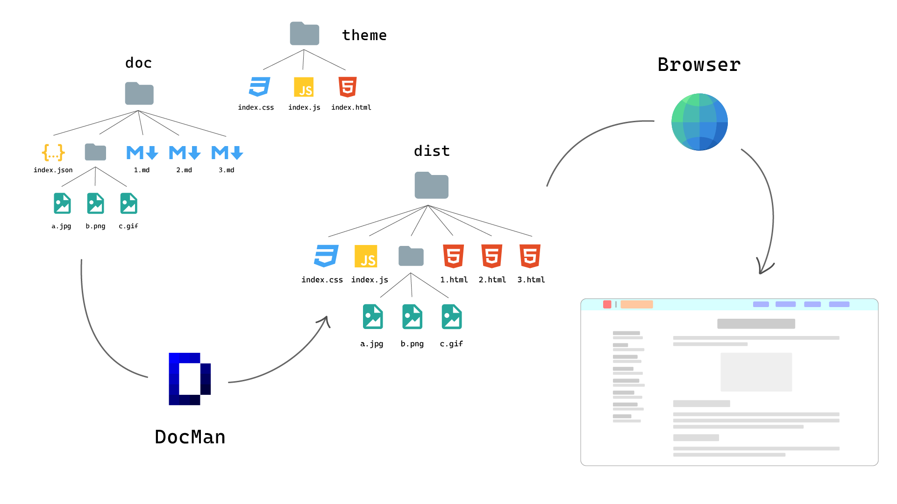

# DocMan - 自由开源的文档站点生成器

DocMan 是一个自由开源的文档站点生成器，它可以让我们优雅、简洁的生成和部署开发文档，API 接口文档，教程，笔记等多种类型的站点。DocMan 依据文档项目的目录索引文件 `index.json` 将 Markdown 文档文件生成为一系列有组织的 HTML 站点文件。



## DocMan

DocMan 官方：

- DocMan 开源项目：[Gitee](https://gitee.com/monkeyhbd/docman) | [GitHub](https://github.com/monkeyhbd/docman)
- DocMan 文档项目：[Gitee](https://gitee.com/monkeyhbd/docman-document) | [GitHub](https://github.com/monkeyhbd/docman-document)
- DocMan 项目网站：[DocMan](https://docman.monkeyhbd.com)

使用 DocMan 创建的文档站点：

- DocMan 文档：[DocMan 文档](https://docman.monkeyhbd.com)
- ProGit（转载）(i18n)：[中文](https://www.monkeyhbd.com/progit) | [English](https://www.monkeyhbd.com/progit/en) | [	Русский](https://www.monkeyhbd.com/progit/ru) | [日本語](https://www.monkeyhbd.com/progit/jp) | [한국어](https://www.monkeyhbd.com/progit/kr)

## 开始使用

### 1. 安装：创建 DocMan 实例

克隆 DocMan 源码

```sh
# Gitee
$ git clone https://gitee.com/monkeyhbd/docman

# GitHub
$ git clone https://github.com/monkeyhbd/docman
```

进入 DocMan 项目目录

```sh
$ cd docman
```

npm 安装依赖

```sh
$ npm install
```

### 2. 导入：导入文档项目

创建 `docs` 文件夹

```
$ mkdir docs
$ cd docs
```

导入我们的 DocMan 官方文档

```sh
# Gitee
$ git clone https://gitee.com/monkeyhbd/docman-document.git

# GitHub
$ git clone https://github.com/monkeyhbd/docman-document.git
```

配置目录索引文件 `index.json`（已经配好了）

```json
{
	"title": "DocMan 官方文档",
	"author": "Monkeyhbd",
	"list": [
		{
			"title": "DocMan 简介",
			"describe": "自由开源的文档类网站生成器",
			"path": "./01-introduction.md",
			"rename": "index"
		}
		...
	]
}
```

### 3. 生成：运行 DocMan 生成站点

更新 DocMan 配置文件 `docman.config.json` ，将 `inputDir` 指向刚刚导入的文档项目

```json
{
	"inputDir": "./docs/docman-document",

	"outputDir": "./dist",

	"themeDir": "./themes/docman-theme-classic"
}
```

运行 DocMan 生成站点

```sh
$ npm run build
```

### 4. 部署：使用 Nginx / Apache 部署文档站点

Nginx 配置

```
server {
        listen 80;
        root /path_to_docman/dist;
        index index.html index.htm;
        server_name example.com;
        location / {
                index index.html index.htm;
                try_files $uri $uri/ $uri/index.html $uri.html =404;
        }
}
```

重启 / 重加载 Nginx

```sh
$ sudo systemctl restart nginx
```
